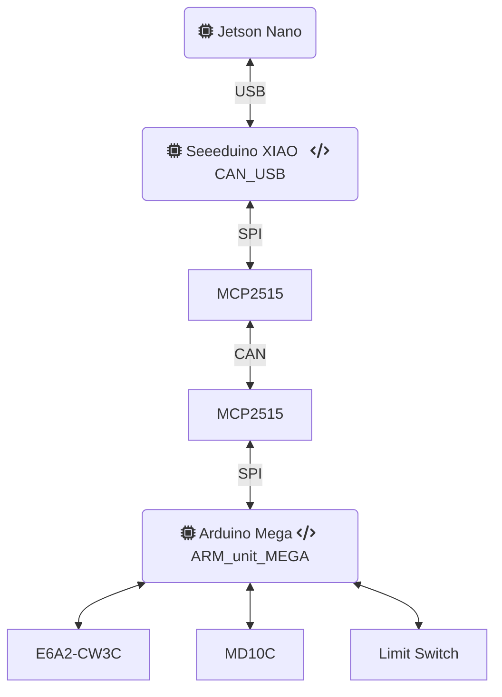
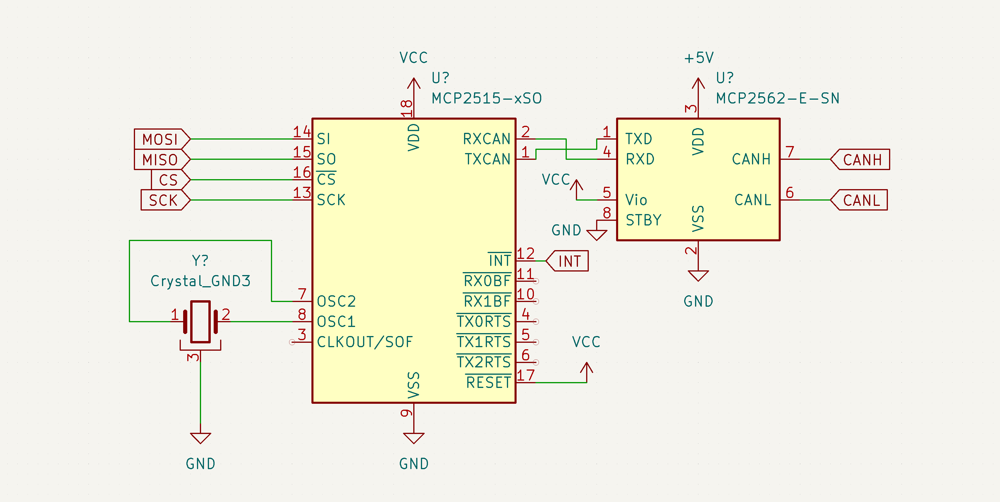
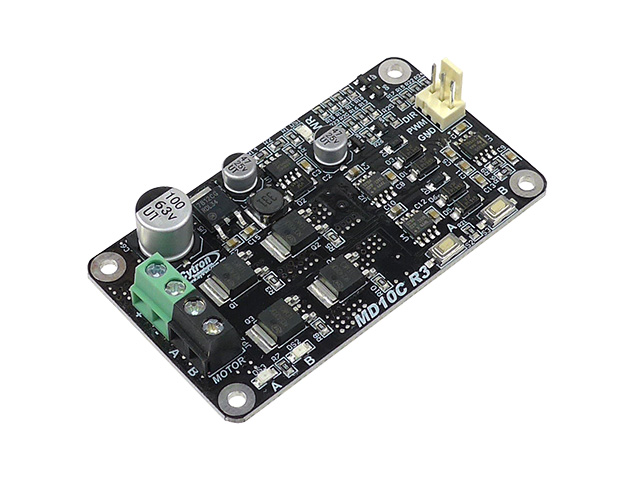
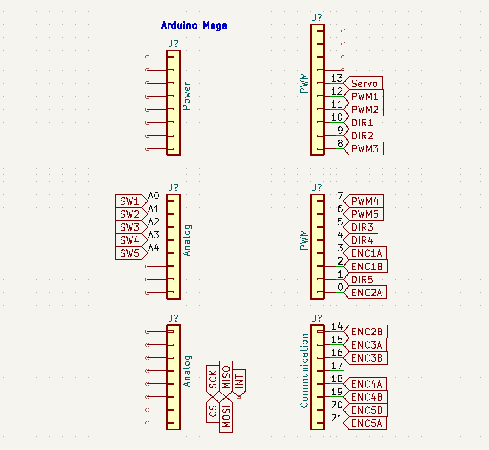

# ARM Controller
2023年の2~3月あたりにアームまわりの電装を開発してた[藤田](https://twitter.com/771_8bit)です。

## 全体像
Jetson Nanoからアームを制御するための電装です。

* 通信には拡張性のためにCANを使う
    * Jetson NanoからCANコントローラMCP2515を扱うのは面倒なため、Seeeduino XIAOを介してCANを扱う
    * Jetson Nanoに直接MCP2515を接続するためにデバイスドライバをいじるのがかなりダルかった
* アームの制御はArduino Megaで行う
    * モーターとエンコーダとスイッチとそれなりにピン数がほしいのでMegaかDue
    * ロータリエンコーダの電圧が5VだからMegaがいい
    * DueにはCANコントローラが内蔵されてるけど、JetsonでもArduino経由でMCP2515を使うからMegaからMCP2515を使ったほうが結局楽
    * ハイスペックなマイコンが必要なわけでもないのでMegaでいい
* サーボモータ1つとDCモーター5つを制御する
    * DCモーターのモータードライバは[MD10C R3](https://www.cytron.io/p-10amp-5v-30v-dc-motor-driver)
    * サーボモータは[DS5160](https://www.amazon.co.jp/dp/B07XBYKB65)
    * DCモーター1つにロータリエンコーダとリミットスイッチが1つずつ(ロータリエンコーダは減らすかも)


<!--https://mermaid.live/edit-->

## CAN
CAN通信はController Area Networkの略で、もとは自動車内の通信用です。差動伝送のペアの信号線にノードを接続する多対多の通信規格です。送信時はデータの種類を示してデータを垂れ流して受信時は欲しいデータを受け取るだけで、全てをコントロールするマスターはありません。通信相手を指定するのではなく通信内容を指定するのがCANの特徴です。差動伝送であるため電気的なノイズに強く、CRCによる誤り検出も備えていて信頼性の高い規格です。

標準フォーマットのCANでは、11bitのIDをつけて最大8byteのデータをやりとりできます。ここでは**uint32_tのデータ**を1つ送るために4byteのデータを送受信します。

### CANハードウェア
ArduinoでCAN通信を行うには、[MCP2515](https://akizukidenshi.com/catalog/g/gI-12030/)というCANコントローラと、[MCP2562](https://akizukidenshi.com/catalog/g/gI-14383/)というCANトランシーバーを使います。CANコントローラがSPIからCANに変換し、CANトランシーバーが差動通信に変換します。2つのICが一体になった[MCP25625](https://akizukidenshi.com/catalog/g/gI-12663/)もありますが、表面実装のパッケージしかないのでARESではMCP2515とMCP2562を使います。

回路図は以下の通りです。MCP2562のSLEEPはLOWにする必要があります。VCCはSeeeduino XIAOなら3.3V、Arduino Megaなら5Vです。


### CANソフトウェア
ライブラリは[mcp_can](https://www.arduino.cc/reference/en/libraries/mcp_can/)を使います。```CAN_1000KBPS```として1Mbpsで通信します。

以下のような共用体を作り、CANのデータを格納します。```uint32_data```と```uint8_data```が同じメモリを共有し、CANで送信するuint8_tの配列にuint32_tのデータを変換します。

パディングを避けるため、```uint32_data```を先に定義します。


```cpp
typedef union
{
  uint32_t uint32_data;
  uint8_t uint8_data[4];
} msg_union;
msg_union msg = {0};
```

CANのIDの割り振りは以下の通りです。
|  ID  |  用途  |
| ---- | ---- |
|  0x100  |  サーボの角度指定  |
|  0x101  |  モーター1の速度指定  |
|  0x102  |  モーター2の速度指定  |
|  0x103  |  モーター3の速度指定  |
|  0x104  |  モーター4の速度指定  |
|  0x105  |  モーター5の速度指定  |
|  0x201  |  モーター1の角度取得  |
|  0x202  |  モーター2の角度取得  |
|  0x203  |  モーター3の角度取得  |
|  0x204  |  モーター4の角度取得  |
|  0x205  |  モーター5の角度取得  |
* サーボの角度指定
    * 送信した値がServo.write()の引数になる。単位は度。
* モーターの速度指定
    * 範囲は0-511で256で停止、その前後で正転逆転。
* モーターの角度取得
    * ロータリエンコーダの値の絶対値。
### CAN USB変換
Seeeduino XIAOを使ってJetson NanoからのUSBをCANに変換します。ここでCANに変換することで、足回りやアーム、バイオの機構にもCANを使うことができます。

送信フォーマットは以下の通りです。CANから受信した時も同じフォーマットでからUSBに送られます。
```
id(16進数表記),数値(10進数uint32_t)\n
```

Jetsonからは、```pip install pyserial```でインストールして、以下のコードで送信します。
```python
import serial

%デバイス名は変わるかも
_serial = serial.Serial("/dev/ttyACM0")
_serial.baudrate = 115200

%毎回の送信はこれだけ
_serial.write("101,300\n")
```

## モータードライバ


* モータードライバ[MD10C R3](https://www.cytron.io/p-10amp-5v-30v-dc-motor-driver)の仕様
    * PWMピンで速度を、DIRピンで回転方向を制御する
    * PWM・DIRピンの電圧は3.3Vでも5Vでも問題ない
    * PWMの周波数がそのままモーターのスイッチング周波数になる

* [メーカー公式のライブラリ](https://www.arduino.cc/reference/en/libraries/cytron-motor-drivers-library/)の仕様
    * MD10Cは```PWM_DIR```を使う
    * ライブラリには```setSpeed```で-255~255の値を渡す
    * PWM出力は内部で[analogWrite](https://github.com/CytronTechnologies/CytronMotorDriver/blob/master/CytronMotorDriver.cpp#L29)を使ってる

## リミットスイッチ
* ただのマイクロスイッチで、マイコンで内蔵プルアップする

## ロータリエンコーダ
* [ライブラリ](https://www.arduino.cc/reference/en/libraries/encoder/)の仕様
    * [ドキュメント](https://www.pjrc.com/teensy/td_libs_Encoder.html)がそれなりに詳しい
    * 割込ピン(2,3,18,19,20,21)を優先的に使う
    * 他のピンを使うと```read()```を呼び出したときだけ[ピンの状態を読み取る](https://www.pjrc.com/teensy/td_libs_Encoder.html#polling)
* ソフトの仕様
    * タイマ割り込みで100Hzでロータリエンコーダの値をCANに送信する
    * 割込ピンでないピンはloop内で```read()```を呼び出す
    * リミットスイッチが押されたときはエンコーダの値を0にする
    * 値は絶対値をとって送信する

## サーボモータ
サーボモータの角度の初期値は以下のように指定しています。
```cpp
#define SERVO_default 90
```
## Megaのピン割当
タイマ割当に関しては[これ](https://qiita.com/srs/items/68981b6e695e6f4468ff)を参考にしました。

|  タイマ  |  用途  |
| ---- | ---- |
|  timer0  |  時間関数(delay,millis)  |
|  timer1  |  PWM(11,12)  |
|  timer2  |  未使用  |
|  timer3  |  [タイマ割り込み](https://qiita.com/GANTZ/items/1ae1797878bd7cefce7e)  |
|  timer4  |  PWM(6,7,8)  |
|  timer5  |  Servo.h  |


[Megaのピン配置詳細](https://content.arduino.cc/assets/Pinout-Mega2560rev3_latest.pdf)



## プロトタイプ基板


サーボピン配置(左から)
* GND
* VCC
* PWM

エンコーダピン配置(上から)
* A
* B
* 5V
* GND


## ToDo
今は最低限の機能だけ実装しています。本来は以下の機能が必要です。
* 起動時にリミットスイッチにあてて原点復帰を行う
* ロータリエンコーダの値から、動作範囲を超えて動かないようにする
* ロータリエンコーダの値を分かりやすい単位にする